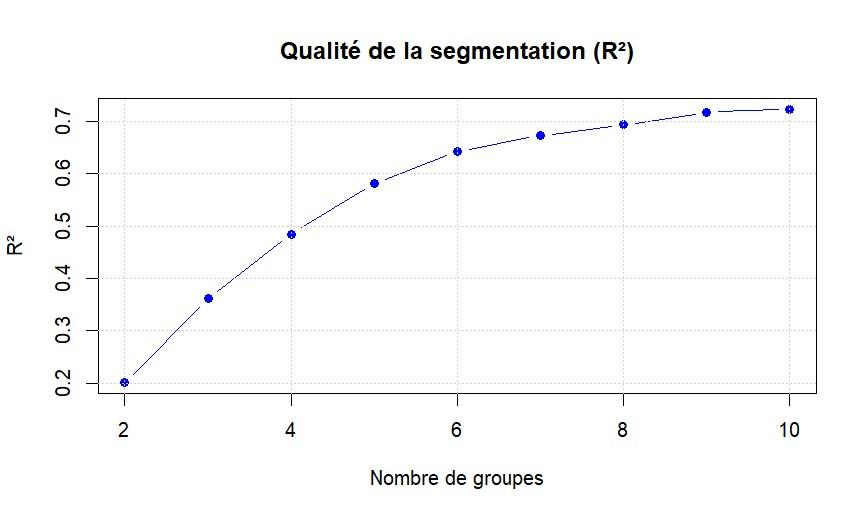
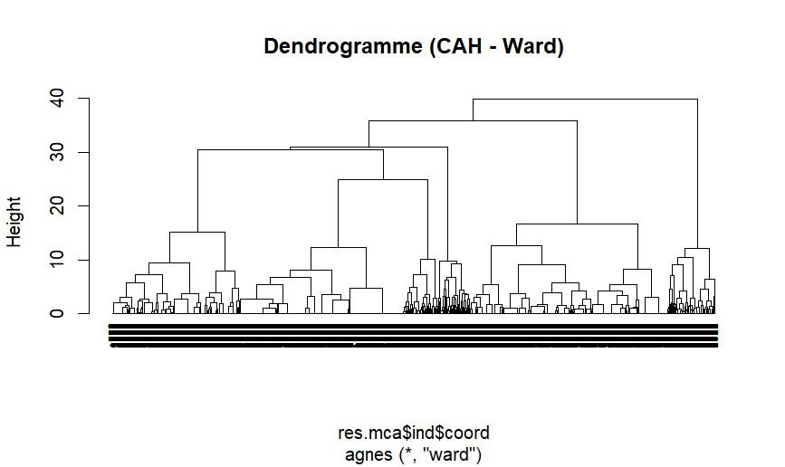
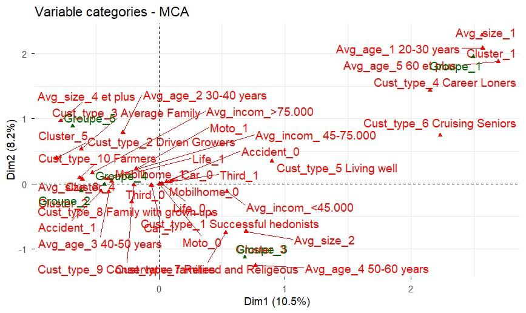

# Segmentation et scoring – Assurance Mobil-Home

Projet de data mining (BUT Science des Données, parcours VCOD – Université de Lorraine, Metz)
réalisé en binôme par **Enes ESER** et **Omar MARFOUK**.

## Contexte

Une base de **5 822 clients** dont seulement **~6 %** (348) détiennent l'assurance Mobil-Home.
Deux objectifs :

1. **Segmentation** : identifier des groupes de clients homogènes.
2. **Scoring** : estimer la probabilité qu'un client souscrive à l'assurance afin de cibler les meilleurs prospects.

## Méthodologie

| Étape | Outil / méthode |
|---|---|
| Nettoyage, recodage, tableaux croisés dynamiques | Excel |
| Exploration des variables qualitatives | AFCM (`FactoMineR`) |
| Choix du nombre de groupes | K-means + méthode du coude (R²) |
| Confirmation de la segmentation | CAH, méthode de Ward (`cluster`) |
| Modèle prédictif | Régression logistique sur échantillon équilibré (348 « oui » / 348 « non », 80 % apprentissage / 20 % test) |
| Ciblage | Score de probabilité, extraction du Top 50 des prospects |

Variables recodées : taille du foyer (`avgsiz`), âge moyen (`avgage`), revenu moyen (`avgincom`)
en classes, et indicateurs de contrats (`Car`, `Third`, `Moto`, `Life`, `Accident`, `Mobilhome`).

## Résultats

### Segmentation en 5 groupes

Le coude du R² apparaît autour de 5 groupes, confirmé par la CAH (Ward).

| Groupe | Effectif | Profil | Potentiel Mobil-Home |
|---|---|---|---|
| 1 | 1 227 | Jeunes familles actives | Potentiel futur |
| 2 | 1 909 | Couples seniors modestes | Faible (budget limité) |
| 3 | 1 916 | Familles aisées (40-50 ans, revenus > 75 k€, foyers ≥ 4 personnes) | **Cible cœur** |
| 4 | 463 | Isolés à faibles revenus | Nul |
| 5 | 307 | Profils atypiques | Niche |





### Modèle de scoring

Facteurs les plus influents (régression logistique) :

- **Posséder une assurance auto** : coefficient +1,36 (facteur le plus discriminant)
- **Foyer de 4 personnes et plus** : coefficient +1,02
- **Revenus < 45 k€** : coefficient −0,56

Les contrats Moto, Life, Accident et Third ne sont pas significatifs (p-value > 5 %).

Performance sur l'échantillon de test (138 individus) : **précision globale de 68,84 %**
(51 acheteurs sur 69 correctement identifiés, soit 74 %).

| | Réel : NON | Réel : OUI |
|---|---|---|
| **Prédit : NON** | 44 | 18 |
| **Prédit : OUI** | 25 | 51 |

Le modèle est appliqué aux clients non assurés pour obtenir un classement ; les 50 meilleurs scores
sont exportés dans `Top50_Clients_Prioritaires.csv` (familles aisées et motorisées).

## Contenu du dépôt

```
├── analyse.R                        # Code complet : AFCM, K-means, CAH, régression, Top 50
├── Assurance.xlsx                   # Données (onglet « tableau recode » utilisé par le script)
├── Top50_Clients_Prioritaires.csv   # Résultat : 50 prospects au score le plus élevé
├── Rendu_TPPART2.pdf                # Rapport
├── TP_DATAMINING.Rproj              # Projet RStudio
└── images/                          # Figures du rapport
```

## Reproduire l'analyse

```r
install.packages(c("readxl", "FactoMineR", "factoextra", "cluster", "dplyr", "caret"))
# Ouvrir le projet dans RStudio (ou fixer le répertoire de travail sur le dossier), puis :
source("analyse.R")
```

Le script fixe une graine aléatoire (`set.seed(123)`) : les chiffres peuvent différer légèrement du rapport
(échantillon équilibré tiré au hasard).

## Données

Jeu de données fourni dans le cadre du cours (5 822 clients) ; publié ici avec l'autorisation de l'enseignant.
Le fichier `Assurance.xlsx` contient les données brutes, le tableau recodé (onglet « tableau recode ») et les tableaux croisés dynamiques.

## Outils

R · FactoMineR · factoextra · cluster · caret · dplyr · Excel
